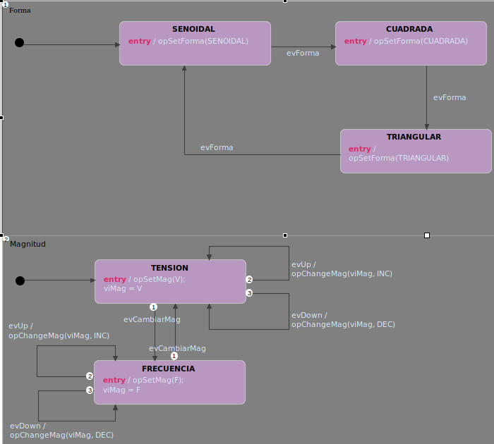

# Ejercicio 3

Implementar (editar, simular y generar el código) el modelo de control de Panel de Control de un generador de señales (tensión de 0 a 10V, frecuencia de 20 a 20.000Hz y 3 formas de señal)


Para implementar el Panel de Control se utilizaron dos diagramas concurrentes, uno para seleccionar la forma y otro para seleccionar la magnitud (tanto tensión como frecuencia). A continuación se muestra una figura con el diagrama de estados del sistema.



Los eventos que producen tansiciones de estados son:

```evForma```: produce un cambio en la forma de la señal mediante un botón
```evCambiarMag```: produce un cambio en la magnitud a cambiar (Tensión o Frecuencia)
```evUp```: produce un incremento en la magnitud seleccionada
```evDown```: produce un decremento en la magnitud seleccionada

La primer región se compone de 3 estados: ```SENOIDAL```, ```TRIANGULAR```, ```CUADRADA```. El estado por default es ```SENOIDAL```, y mediante ```evForma``` se cicla entre las 3 formas posibles.

La segunda región se compone de 2 estados: ```TENSION``` y ```FRECUENCIA``` en la cual se puede cambiar la tensión y frecuencia de la señal, respectivamente. Mediante ```ecCambiarMag``` se cicla entre selección de tensión y de frecuencia, y mediante ```evUp``` y ```upDown``` se incrementa y decrementa la magnitud seleccionada, respectivamente.

Para señalizar la forma de la señal se utilizan los LEDR (senoidal), LEDG (cuadrada) y LEDB (triangular).

Para señalizar la magnitud seleccionada se utiliza el LED1: apagado para tensión, encendido para frecuencia.

Para señalizar el incremento y decremento en la magniutd, se utiliza el LED2 y LED3 respectivamente. 


