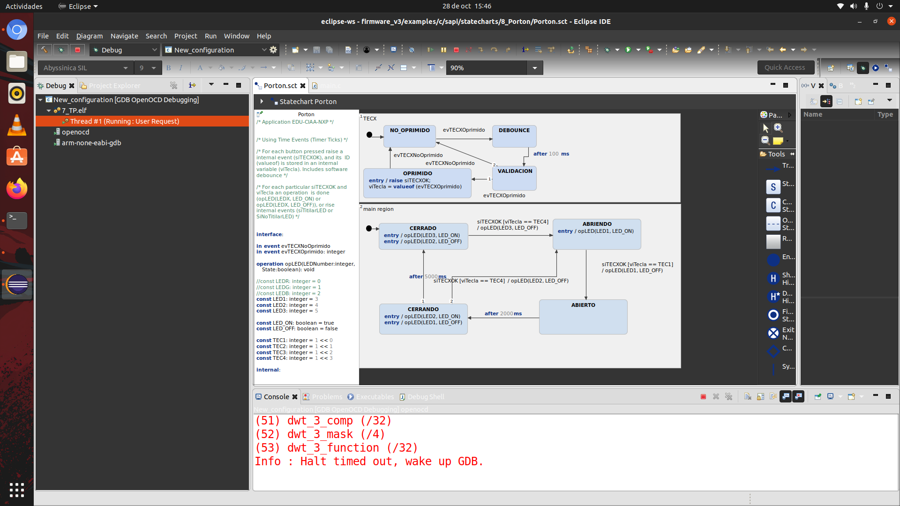

# Ejercicio 4

> Implementar (editar, simular y generar el código) el modelo de control de Puerta Corrediza automatizada (motor con movimiento en dos sentidos, sensor de presencia y fines de carrera)

En este ejercicio se implemento el control de la puerta corrediza automatizada. A continuación se muestra una figura con el diagrama de estados del modelo

El diagrama cuenta con dos regiones: TECX y main region.

