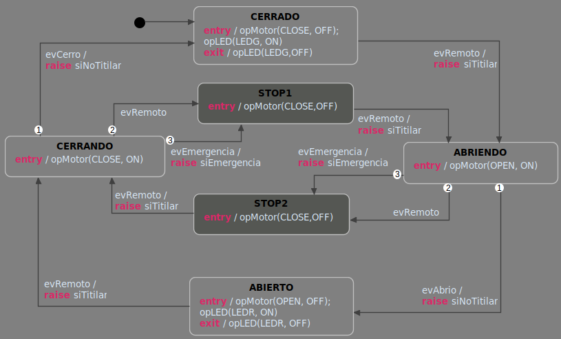
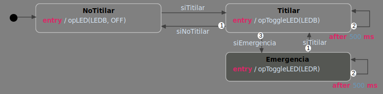

# Ejercicio 5

> Implementar (editar, simular y generar el código) el modelo de control de Portón Levadizo automatizado (motor con movimiento en dos sentidos, control remoto de apertura/cierre, fines de carrera y señalización luminosa)

En este ejercicio se implementó el control del Portón Levadizo automatizado, el cual se puede accionar mediante control remoto (tanto para abrir como para cerrar) y frenar al sensar obstáculos.

A continuación se muestra una figura con el diagrama de estados del modelo

El diagrama cuenta con dos regiones: Portón y Luz. En la región de Portón se realiza el accionamiento del portón propiamente dicho: 
