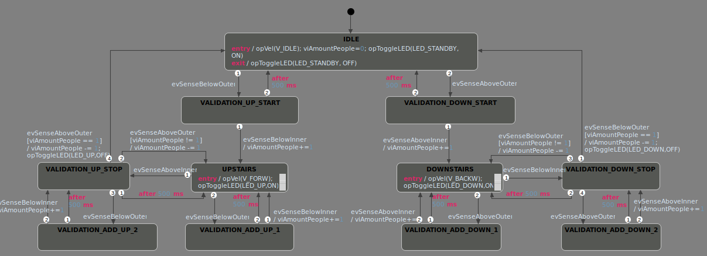

# Ejercicio 6: Escalera mecánica

Implementar (editar, simular y generar el código) el modelo de control de Escalera Mecánica unidireccional automatizada (motor c/movimiento en un sentido y dos velocidades, sensores de ingreso, egreso y señalización luminosa).

Se diseñó el modelo de control de una escalera mecánica unidireccional con dos velocidades capaz de avanzar o retroceder según el orden en el que se reciban las señales de los distintos sensores.

Se asumió que se contaba con cuatro sensores, dos en la parte superior de la escalera y dos en la parte inferior. Esto en el diagrama de estados adjunto se representó de la siguiente manera: Los dos sensores de la entrada inferior de la escalera se llamaron BelowOuter (exterior), BelowInner (interior); de la misma forma para los dos sensores de la entrada superior de la escalera se denominaron AboveInner y AboveOuter. A partir de estos sensores se definen eventos que cambiarán el modo de operación de la escalera. La escalera acelera hacia arriba solo si se detecta primero un sensado de BelowOuter, seguido por BelowInner, que indicaría que una persona efectivamente ingresó a la escalera. El mismo comportamiento ocurre para acelerar la escalera hacia abajo, utilizando los sensores superiores.

Se debió validar que los dos sensores sean activados dentro de un intervalo de tiempo para eliminar posibles falsos positivos, donde la persona parece ingresar a la escalera pero no cruza por el segundo sensor.

Una vez que el comportamiento principal queda resuelto, se tiene otro nivel de dificultad al contemplar que pueden haber más personas ingresando a la escalera. En ese caso se utiliza una variable acumuladora. Por cada vez que se sensa X_outer seguido por X_inner el acumulador aumenta en 1, ya que indica que una persona ingreso a la escalera, de la misma maner si se sensa X_inner seguido por X_outer, el acumulador disminuye en 1, indicando que una persona salió de la escalera. Si y sólo si ese acumulador es igual a 0, entonces la escalera se frenará.

