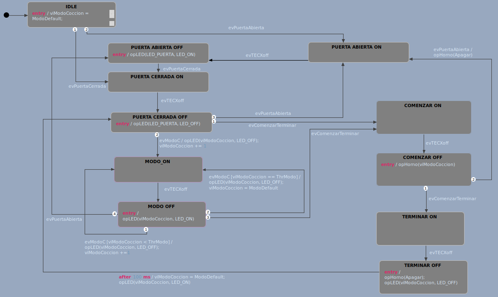

En este ejercicio se diseñó el modelo de control de Horno Microondas con 3 modos seleccionables por botón de modo, implementando un botón para Comenzar/Terminar, y botón de sensor de apertura de puerta.

A continuación se muestra el diagarama de estados del modelo de control:



Los eventos que se definieron en base a los botones son los siguientes:

```evComenzarTerminar``` Presión del botón para Comenzar/Terminar la cocción
```evModoC``` Presión del botón de cambio de modo de cocción
```evPuertaAbierta``` Sensado de puerta abierta
```evPuertaCerrada``` Sensado de puerta cerrada
```evTECXoff``` Evento para validar el presionado de los botones, sucede cuando se deja de presionar un botón

El programa inicia en el estado ```IDLE``` en el cual se setea el modo de cocción al default (mediante la variable interna ```viModoCoccion```). En este estado se espera que se produzca el evento abrir o cerrar la puerta, para poder pasar a los próximos estados (```PUERTA ABIERTA ON``` o ```PUERTA CERRADA ON```). Los estados ```PUERTA ABIERTA OFF``` y ```PUERTA CERRADA OFF``` se utilizan para validar el presionado del botón ya que se transiciona al producirse el evento ```evTECXoff```.

Una vez que se encuentra en el estado de puerta cerrada ```PUERTA CERRADA OFF``` se puede elegir el modo de cocción, el cual se setea mediante un único botón que cicla entre los 3 modos de cocción disponibles. 


En la imagen anterior se puede oservar que al presionar el botón correspondiente al tipo de cocción (y validarlo) se actualiza la variable interna ```viModoCoccion```, y se reinicializa al modo default luego de terminar el ciclo. 

Al producirse el evento ```evComenzarTerminar``` se inicia la cocción, la cual puede ser terminar mediante el presionado del botón de Comenzar/Terminar (```evComenzarTerminar```), o mediante la apertura de la puerta (```evPuertaAbierta```).


El botón asociado a la selección de cocción es ```TEC1```. 
El botón asociado a la apertura de puerta es ```TEC2```. 
El botón asociado al cierre de puerta es ```TEC3```.
El botón asociado a Comenzar/Terminar es ```TEC4```. 

El LED RGB se utiliza para señalizar el estado de funcionamiento del horno (rojo en no-cocción, verde en cocción y azul en puerta abierta). Los LEDS LED1, LED2 y LED3 señalizan el modo de cocción seleccionado. 

Las funciones utilizadas para la implementación del modelo son:

```c
  void opHorno(sc_boolean moodo);
```

```c
  void opLED(sc_integer LED_NUMBER, sc_boolean modo);
```
El programa se probó en la placa EDU-CIAA y se confirmó el funcionamiento deseado.
