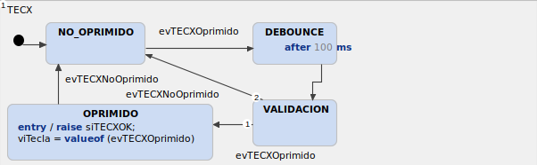
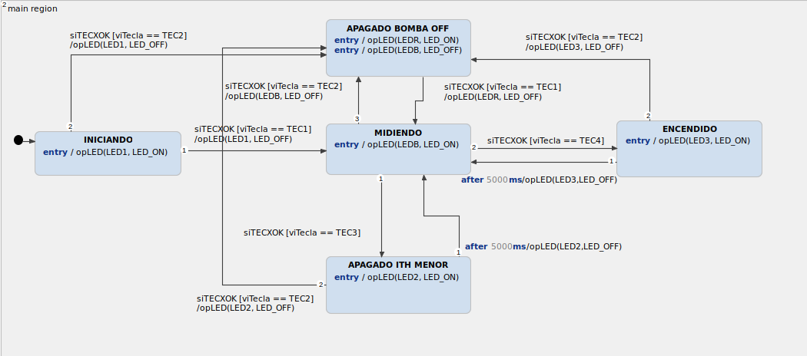

# Ejercicio 8: Parte X de TP Final

> Implementar (editar, simular) el modelo de control de una parte de la implementación de su TPF.

En este ejercicio se implemento la maquina de estado perteneciente al trabajo practico final del alumno Massone Maximiliano. Donde consta de un sistema de automatizacion para la reduccion del estres por calor producido en los animales que se encuentran en el corral de espera de un tambo. Donde dicha decision se toma a traves del indice de ITH  (indice de temperatura y humedad). A continuacion se muestra captura del programa simulado y demostrado en clases.

